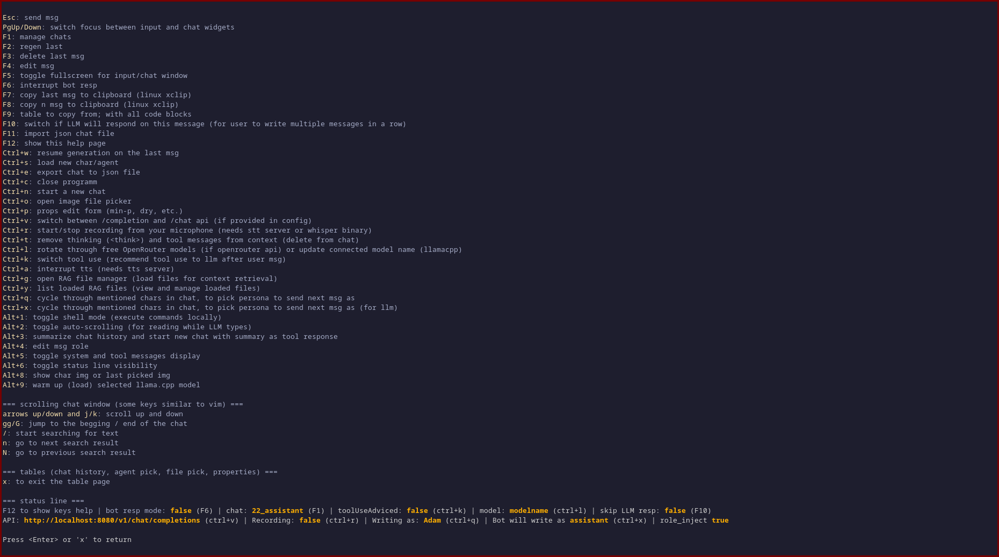

### gf-lt (grail finder's llm tui)
terminal user interface for large language models.
made with use of [tview](https://github.com/rivo/tview)

#### has/supports
- character card spec;
- API (/chat and /completion): llama.cpp, deepseek, openrouter;
- tts/stt (run make commands to get deps);
- image input;
- function calls (function calls are implemented natively, to avoid calling outside sources);
- [character specific context (unique feature)](docs/char-specific-context.md)

#### how it looks


#### how to install
(requires golang)
clone the project
```
git clone https://github.com/GrailFinder/gf-lt.git
cd gf-lt
make
```

to run without tts/stt dependencies use
```
make noextra-run
```

#### keybinds
while running you can press f12 for list of keys;


#### setting up config
```
cp config.example.toml config.toml
```
set values as you need them to be;
[description of config variables](docs/config.md)

#### setting up STT/TTS services
For speech-to-text (STT) and text-to-speech (TTS) functionality:
1. The project uses Whisper.cpp for STT and Kokoro for TTS
2. Docker Compose automatically downloads the required Whisper model on first run
3. To start all services: `make docker-up`
4. To start only STT service: `make docker-up-whisper`
5. To start only TTS service: `make docker-up-kokoro`
6. To stop all services: `make docker-down`
7. To stop only STT service: `make docker-down-whisper`
8. To stop only TTS service: `make docker-down-kokoro`
9. To view all service logs: `make docker-logs`
10. To view only STT service logs: `make docker-logs-whisper`
11. To view only TTS service logs: `make docker-logs-kokoro`
12. The STT service runs on http://localhost:8081
13. The TTS service runs on http://localhost:8880
