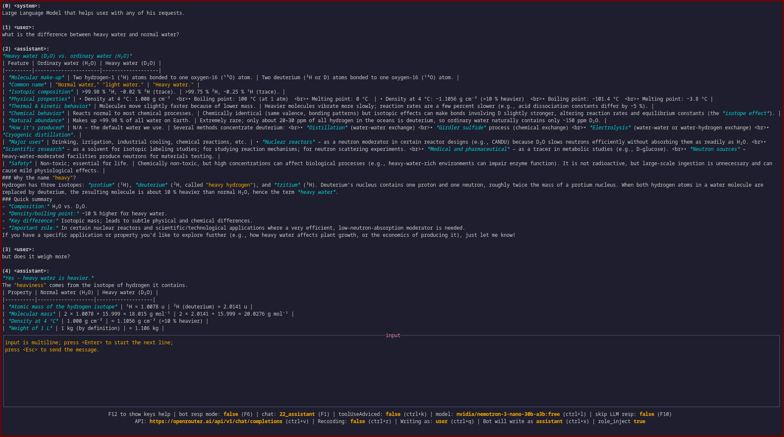

### gf-lt (grail finder's llm tui)
terminal user interface for large language models.
made with use of [tview](https://github.com/rivo/tview)

#### has/supports
- character card spec;
- llama.cpp api, deepseek, openrouter (other ones were not tested);
- showing images (not really, for now only if your char card is png it could show it);
- tts/stt (if whisper.cpp server / fastapi tts server are provided);

#### does not have/support
- images; (ctrl+j will show an image of the card you use, but that is about it);
- RAG; (RAG was implemented, but I found it unusable and then sql extention broke, so no RAG);
- MCP; (agentic is implemented, but as a raw and predefined functions for llm to use. see [tools.go](https://github.com/GrailFinder/gf-lt/blob/master/tools.go));

#### usage examples


#### how to install
(requires golang)
clone the project
```
cd gf-lt
make
```

#### keybindings
while running you can press f12 for list of keys;
```
Esc: send msg
PgUp/Down: switch focus between input and chat widgets
F1: manage chats
F2: regen last
F3: delete last msg
F4: edit msg
F5: toggle system
F6: interrupt bot resp
F7: copy last msg to clipboard (linux xclip)
F8: copy n msg to clipboard (linux xclip)
F9: table to copy from; with all code blocks
F10: switch if LLM will respond on this message (for user to write multiple messages in a row)
F11: import chat file
F12: show this help page
Ctrl+w: resume generation on the last msg
Ctrl+s: load new char/agent
Ctrl+e: export chat to json file
Ctrl+n: start a new chat
Ctrl+c: close programm
Ctrl+p: props edit form (min-p, dry, etc.)
Ctrl+v: switch between /completion and /chat api (if provided in config)
Ctrl+r: start/stop recording from your microphone (needs stt server)
Ctrl+t: remove thinking (<think>) and tool messages from context (delete from chat)
Ctrl+l: update connected model name (llamacpp)
Ctrl+k: switch tool use (recommend tool use to llm after user msg)
Ctrl+j: if chat agent is char.png will show the image; then any key to return
Ctrl+a: interrupt tts (needs tts server)
Ctrl+q: cycle through mentioned chars in chat, to pick persona to send next msg as
```

#### setting up config
```
cp config.example.toml config.toml
```
set values as you need them to be.
