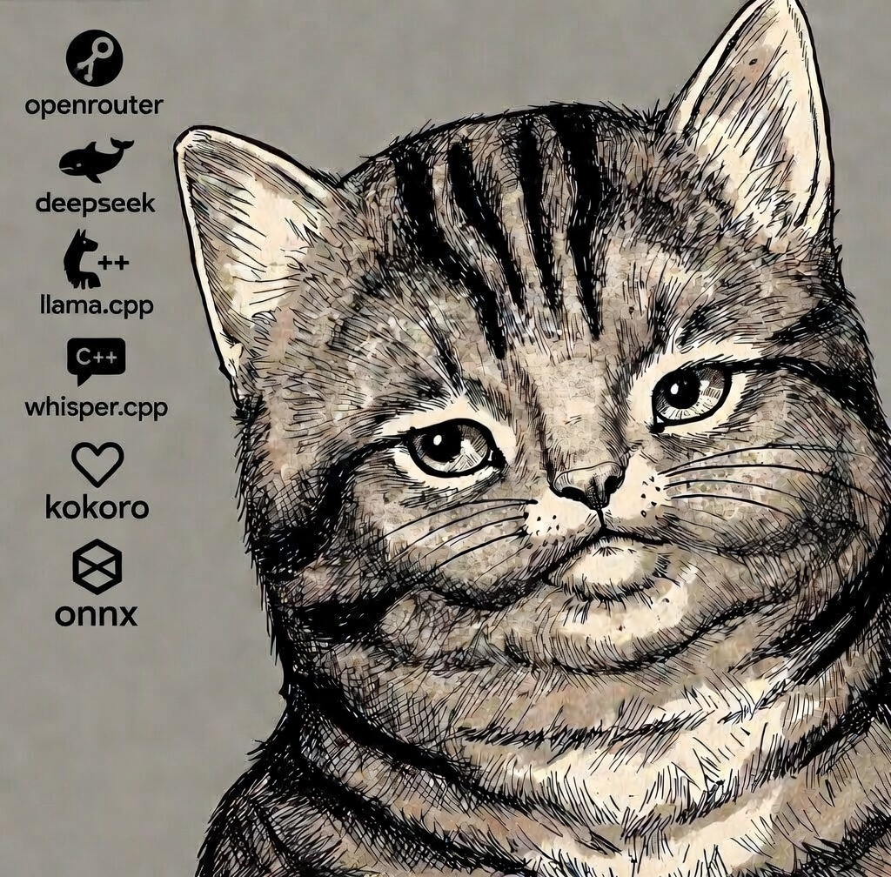
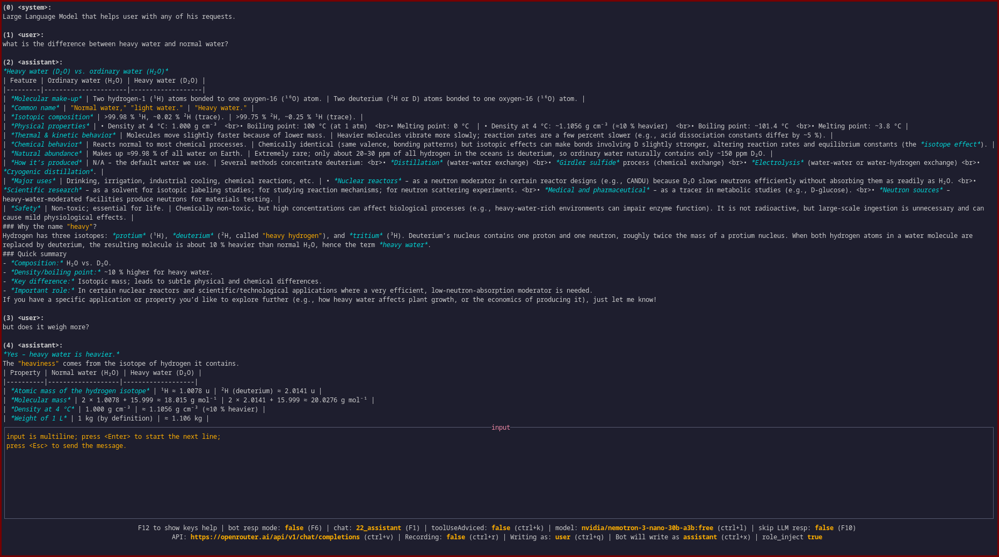
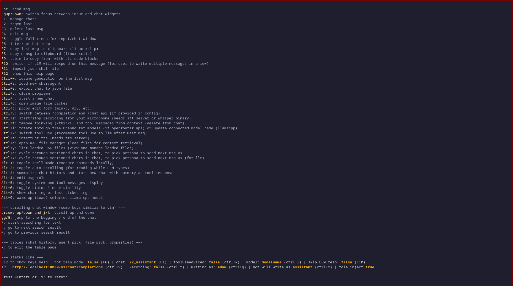

### gf-lt (grail finder's llm tui)
terminal user interface for large language models.
made with use of [tview](https://github.com/rivo/tview)

#### has/supports
- character card spec;
- API (/chat and /completion): llama.cpp, deepseek, openrouter, opencode go;
- tts/stt (run make commands to get deps);
- image input;
- function calls (function calls are implemented natively, to avoid calling outside sources);
- [character specific context (unique feature)](docs/char-specific-context.md)


#### showcase on youtube
[](https://youtu.be/WCS4Xc902F8 "gf-lt showcase")

#### feature map

[interactive/regeneratable source + notes](docs/featuremap.md) · [toolset issues & improvement wishes](docs/tool_issues.md)

#### how it looks



#### dependencies
- make
- go
- ffmpeg (extra)

#### how to install
(requires golang)
clone the project
```
git clone https://github.com/GrailFinder/gf-lt.git
cd gf-lt
make
```

to run without tts/stt dependencies use
```
make noextra-run
```

#### keybinds
- use `insert` button to paste text from the clipboard to the text area, instead of shift+insert (might freeze the program);
- press f12 for list of keys;


#### setting up config
```
cp config.example.toml config.toml
```
set values as you need them to be;
[description of config variables](docs/config.md)

#### setting up STT/TTS services
STT and TTS are separate HTTP servers, configured in `config.toml`. This project does not
build or start them for you; run whichever ones you want yourself.

- **TTS** — any OpenAI-compatible `/v1/audio/speech` server. Set `TTS_URL`, `TTS_MODEL`
  and `TTS_VOICE` in `config.toml`. For `wav` output only, an `audio.cpp` audiocpp_server
  works; make sure `TTS_MODEL` matches an `id` in its `server.json`.
- **STT** — press `Ctrl+R` to start/stop recording. With `STT_TYPE = "openai_compat"`
  (alias `crips_asr`), set `STT_URL` to any server exposing
  `POST /v1/audio/transcriptions`; CrispASR in `--server` mode is one such server.
  The `model` field is ignored by such servers, so `ASR_MODEL` only matters for
  backends that validate it.
