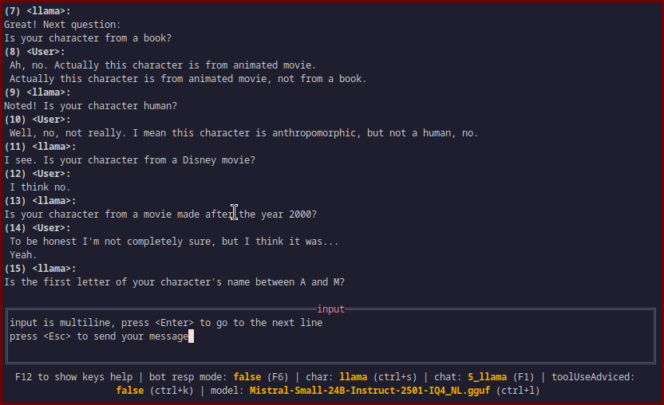

### gf-lt (grail finder's llm tui)
terminal user interface for large language models.
made with use of [tview](https://github.com/rivo/tview)

#### has/supports
- character card spec;
- API (/chat and /completion): llama.cpp, deepseek, openrouter;
- tts/stt (run make commands to get deps);
- image input;
- function calls (function calls are implemented natively, to avoid calling outside sources);

#### usage examples


#### how to install
(requires golang)
clone the project
```
git clone https://github.com/GrailFinder/gf-lt.git
cd gf-lt
make
```

#### keybindings
while running you can press f12 for list of keys;
```
Esc: send msg
PgUp/Down: switch focus between input and chat widgets
F1: manage chats
F2: regen last
F3: delete last msg
F4: edit msg
F5: toggle fullscreen for input/chat window
F6: interrupt bot resp
F7: copy last msg to clipboard (linux xclip)
F8: copy n msg to clipboard (linux xclip)
F9: table to copy from; with all code blocks
F10: switch if LLM will respond on this message (for user to write multiple messages in a row)
F11: import json chat file
F12: show this help page
Ctrl+w: resume generation on the last msg
Ctrl+s: load new char/agent
Ctrl+e: export chat to json file
Ctrl+c: close programm
Ctrl+n: start a new chat
Ctrl+o: open image file picker
Ctrl+p: props edit form (min-p, dry, etc.)
Ctrl+v: switch between /completion and /chat api (if provided in config)
Ctrl+r: start/stop recording from your microphone (needs stt server or whisper binary)
Ctrl+t: remove thinking (<think>) and tool messages from context (delete from chat)
Ctrl+l: rotate through free OpenRouter models (if openrouter api) or update connected model name (llamacpp)
Ctrl+k: switch tool use (recommend tool use to llm after user msg)
Ctrl+j: if chat agent is char.png will show the image; then any key to return
Ctrl+a: interrupt tts (needs tts server)
Ctrl+g: open RAG file manager (load files for context retrieval)
Ctrl+y: list loaded RAG files (view and manage loaded files)
Ctrl+q: cycle through mentioned chars in chat, to pick persona to send next msg as
Ctrl+x: cycle through mentioned chars in chat, to pick persona to send next msg as (for llm)
Alt+1: toggle shell mode (execute commands locally)
Alt+4: edit msg role
Alt+5: toggle system and tool messages display

=== scrolling chat window (some keys similar to vim) ===
arrows up/down and j/k: scroll up and down
gg/G: jump to the begging / end of the chat
/: start searching for text
n: go to next search result
N: go to previous search result

=== tables (chat history, agent pick, file pick, properties) ===
x: to exit the table page

trl+x: cycle through mentioned chars in chat, to pick persona to send next msg as (for llm)
```

#### setting up config
```
cp config.example.toml config.toml
```
set values as you need them to be.

#### setting up STT/TTS services
For speech-to-text (STT) and text-to-speech (TTS) functionality:
1. The project uses Whisper.cpp for STT and Kokoro for TTS
2. Docker Compose automatically downloads the required Whisper model on first run
3. To start all services: `make docker-up`
4. To start only STT service: `make docker-up-whisper`
5. To start only TTS service: `make docker-up-kokoro`
6. To stop all services: `make docker-down`
7. To stop only STT service: `make docker-down-whisper`
8. To stop only TTS service: `make docker-down-kokoro`
9. To view all service logs: `make docker-logs`
10. To view only STT service logs: `make docker-logs-whisper`
11. To view only TTS service logs: `make docker-logs-kokoro`
12. The STT service runs on http://localhost:8081
13. The TTS service runs on http://localhost:8880
